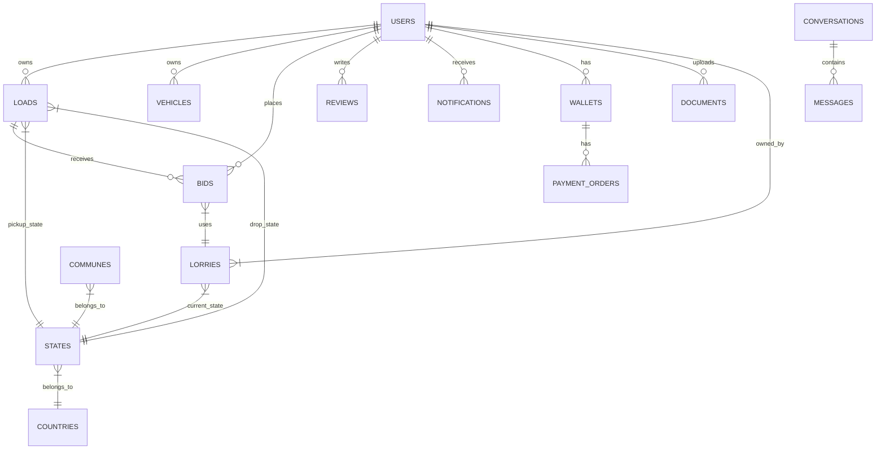

# Database Schema

This section documents the database structure, including tables, columns, types, and relationships.

## Entity Relationship Diagram

## Tables

### Users (`users`)
Core user table for drivers, shippers, and companies.

| Column | Type | Description |
| :--- | :--- | :--- |
| `id` | bigint | Primary Key |
| `name` | string | |
| `email` | string | Unique |
| `password` | string | |
| `mobile` | string | |
| `type` | enum | `user`, `company`, `admin` |
| `is_verified` | enum | `0` (Pending), `1` (Processed), `2` (Verified), `3` (Unverified) |
| `country_code` | string | |
| `refer_code` | string | |
| `fcm_token` | string | Firebase Token |

### Loads (`loads`)
Shipment requests posted by users.

| Column | Type | Description |
| :--- | :--- | :--- |
| `id` | bigint | Primary Key |
| `owner_id` | foreignId | FK to `users` |
| `description` | string | |
| `weight` | double | |
| `amount` | double | |
| `status` | enum | `pending`, `accepted`, `in_progress`, etc. |
| `pickup_point` | string | Address/Name |
| `drop_point` | string | Address/Name |
| `pick_state_id` | foreignId | FK to `states` |
| `drop_state_id` | foreignId | FK to `states` |
| `bidder_id` | string | FK to `users` (nullable) |
| `lorry_id` | string | FK to `lorries` (nullable) |

### Bids (`bids`)
Offers made by drivers/companies on loads.

| Column | Type | Description |
| :--- | :--- | :--- |
| `id` | bigint | Primary Key |
| `load_id` | foreignId | FK to `loads` |
| `owner_id` | foreignId | FK to `users` (Bidder) |
| `lorry_id` | foreignId | FK to `lorries` |
| `amount` | decimal | Bid Amount |
| `status` | string | Status of the bid |

### Vehicles (`vehicles`)
General vehicle profiles (metadata).

| Column | Type | Description |
| :--- | :--- | :--- |
| `id` | bigint | Primary Key |
| `owner_id` | foreignId | FK to `users` |
| `matricule` | string | License Plate |
| `type` | enum | `truck`, `van` |

### Lorries (`lorries`)
Specific truck instances with route and state tracking.

| Column | Type | Description |
| :--- | :--- | :--- |
| `id` | bigint | Primary Key |
| `owner_id` | foreignId | FK to `users` |
| `lorry_no` | string | |
| `weight` | double | Capacity |
| `curr_state_id` | foreignId | FK to `states` |
| `status` | boolean | Availability |

### Wallets (`wallets`)
User balance information.

| Column | Type | Description |
| :--- | :--- | :--- |
| `id` | bigint | Primary Key |
| `user_id` | foreignId | FK to `users` |
| `balance` | double | |

### Locations

#### Countries (`countries`)
| Column | Type | Description |
| :--- | :--- | :--- |
| `id` | bigint | PK |
| `country_code` | string | |

#### States (`states`)
| Column | Type | Description |
| :--- | :--- | :--- |
| `id` | bigint | PK |
| `country_id` | foreignId | FK to `countries` |
| `stateName` | string | |

#### Communes (`communes`)
| Column | Type | Description |
| :--- | :--- | :--- |
| `id` | bigint | PK |
| `state_id` | foreignId | FK to `states` |
| `commune_name` | string | |

### Messaging

#### Conversations (`conversations`)
| Column | Type | Description |
| :--- | :--- | :--- |
| `id` | string | Primary Key (UUID/String) |
| `user1_id` | string | |
| `user2_id` | string | |

#### Messages (`messages`)
| Column | Type | Description |
| :--- | :--- | :--- |
| `id` | bigint | PK |
| `conversation_id` | string | FK to `conversations` |
| `sender_id` | string | |
| `message` | text | |

### Other Tables

- **reviews**: `user_id`, `load_id`, `rate_number`, `rate_text`.
- **notifications**: `user_id`, `notification_type`, `description`.
- **documents**: `user_id`, `imgPath`, `description`.
- **payment_orders**: `wallet_id`, `balance`, `status`.
- **book_loads**: flattened table for booking records.
- **bid_load**: snapshot table for lorry details in bids.
